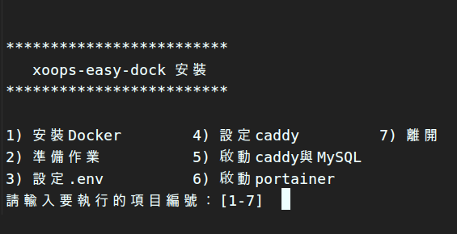
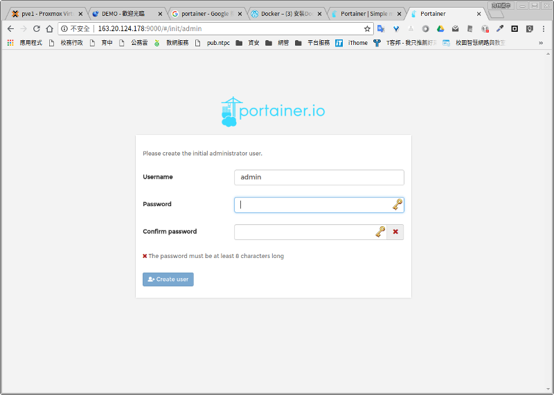
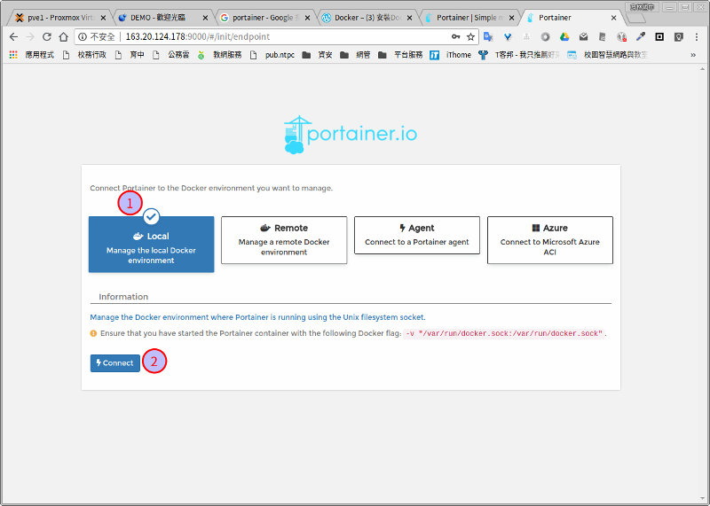

# XOOPS 輕鬆架 in Docker

## 這是啥？

為了在 [Docker](https://www.docker.com/) 環境中安裝 [XOOPS 輕鬆架](https://campus-xoops.tn.edu.tw/)，以 [Laradock](http://laradock.io/) 為基礎修改而來，可以快速完成 XOOPS 輕鬆架之安裝，並且經過簡單設定，即可完成 [Let's Encrypt](https://letsencrypt.org/) 的免費 SSL 憑證申請與自動更新。

## 包含元件

- [Caddy \- The HTTP/2 Web Server with Automatic HTTPS](https://caddyserver.com/)
- php-fpm
- MySQL

## 系統需求

- Debian based OS，建議使用 Ubuntu Server
- CentOS 7 1804
- curl
- unzip

若未安裝 curl、unzip、jq 者，請先進行安裝。
```bash
# Debian based OS
sudo apt install -y unzip curl jq

# CentOS 7
sudo yum install -y epel-release
sudo yum install -y unzip curl jq
```

## 安裝步驟

### 懶人安裝法

執行下列指令即可。
```bash
curl -L https://raw.githubusercontent.com/t301000/xoops-easy-dock/master/lazy.sh -o lazy.sh && chmod +x lazy.sh && ./lazy.sh
```
過程中請務必詳閱各項目之說明，完成後請依標準安裝之步驟4，開啟瀏覽器進行 XOOPS 輕鬆架安裝。

```bash
http(s)://YOUR_SERVER
```

[](http://www.youtube.com/watch?v=3VCOzrGoFBQ "xoops-easy-dock 安裝")


若無法完成安裝，則依標準安裝進行。

### 標準安裝

#### 1. 下載 xoops-easy-dock 並解壓縮

```bash
curl -L https://github.com/t301000/xoops-easy-dock/archive/master.zip -o master.zip
unzip master.zip
```
解壓縮之後會有一個名稱為 xoops-easy-dock-master 之目錄。

#### 2. 重命名目錄

依需要將 xoops-easy-dock-master 目錄重命名，如 xoops ，此步驟可不做。
```bash
mv xoops-easy-dock-master xoops
```

#### 3. 執行安裝腳本

執行安裝腳本，依序完成各個步驟。
```bash
cd xoops
./install.sh
```



#### 4. XOOPS 輕鬆架安裝

開啟瀏覽器進行 XOOPS 輕鬆架安裝。

```bash
http(s)://YOUR_SERVER
```

- 資料庫位址： mysql
- 資料庫名稱： .env 中 MYSQL_DATABASE 之設定值，預設為 default
- 資料庫帳號： .env 中 MYSQL_USER 之設定值，預設為 default
- 資料庫密碼： .env 中 MYSQL_PASSWORD 之設定值，預設為 secret

## 資料庫管理工具

XOOPS 輕鬆架內建 [Adminer](https://www.adminer.org/) 可管理資料庫。

```bash
http(s)://YOUR_SERVER/modules/tad_adm/pma.php
```

- 伺服器：mysql
- 帳號： .env 中 MYSQL_USER 之設定值，預設為 default
- 密碼： .env 中 MYSQL_PASSWORD 之設定值，預設為 secret
- 資料庫： .env 中 MYSQL_DATABASE 之設定值，預設為 default，可不輸入

## 容器管理工具

如果有啟動 [Portainer](https://portainer.io/)，則可由以下網址進入管理，自行替換 網址 與 port (預設 9000)。

```bash
http://YOUR_SERVER:PORT
```

第一次進入時：
1. 建立帳號


1. 連線類型選擇 local

